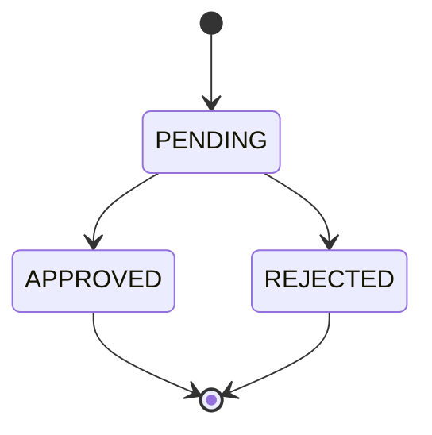
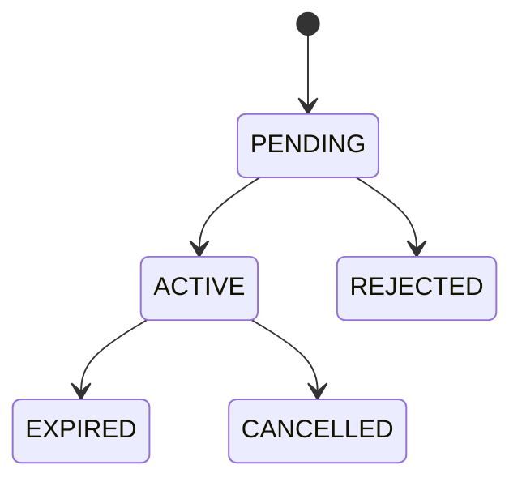

# Detailed Design Document - PlanbookAI

## 1. Thiết kế module chính

### Auth/User
- `auth-service`: `User`, `RefreshToken`, `AuthService`, `AuthController`.
- `user-service`: `UserProfile`, FCM token, profile API.
- Khi Admin tạo Staff/Manager, auth-service tạo account và gọi user-service init profile.

### Curriculum
- Entity: `Subject`, `Chapter`, `Topic`, `CurriculumTemplate`, `SampleLessonPlan`, `LessonPlan`.
- Template do Admin quản lý, Staff/Teacher chọn theo subject/chapter/topic.
- Sample lesson plan có trạng thái `PENDING`, `APPROVED`, `REJECTED`.

### Question Bank
- Entity `Question` lưu nội dung, đáp án, độ khó, subject/chapter/topic và trạng thái duyệt.
- Manager duyệt câu hỏi trước khi Teacher dùng trong đề thi chính thức.

### Prompt AI
- AI service lưu prompt template gồm `name`, `type`, `content`, `version`, `status`.
- Staff CRUD prompt, Manager approve/reject.
- Service gọi Gemini lấy prompt đã duyệt phù hợp nghiệp vụ.

### Exam/OCR
- Exam service tạo đề từ question bank.
- OCR grading client gửi ảnh sang AI service, nhận đáp án detect được và tính điểm.

### Package
- Entity `Package`: name, price, durationDays, description, active.
- Entity `Subscription`: userId, package, startDate, endDate, status, paymentMethod.
- Teacher tạo subscription `PENDING`; Manager/Admin approve thành `ACTIVE` hoặc reject thành `REJECTED`.

## 2. API chính

| API | Method | Role | Mục đích |
| --- | --- | --- | --- |
| `/api/auth/login` | POST | Public | Đăng nhập |
| `/api/users/me` | GET/PUT | User | Xem/sửa profile |
| `/api/curriculum-templates` | CRUD | Admin | Quản lý template |
| `/api/sample-lesson-plans` | CRUD | Staff | Tạo giáo án mẫu |
| `/api/sample-lesson-plans/review/*` | GET/PUT | Manager | Duyệt giáo án mẫu |
| `/api/questions` | CRUD | Staff/Teacher | Ngân hàng câu hỏi |
| `/api/questions/{id}/approve` | PUT | Manager | Duyệt câu hỏi |
| `/api/prompts` | CRUD | Staff | Prompt AI |
| `/api/prompts/{id}/approve` | PUT | Manager | Duyệt prompt |
| `/api/exams` | POST/GET | Teacher | Tạo và xem đề |
| `/api/exams/ocr-grade` | POST | Teacher | OCR chấm bài |
| `/api/packages` | GET/POST/PUT/DELETE | Public/Manager | Gói dịch vụ |
| `/api/subscriptions` | GET/POST | Teacher/Manager | Đăng ký và xem đơn |
| `/api/subscriptions/{id}/approve` | PUT | Manager/Admin | Kích hoạt đăng ký |
| `/api/subscriptions/{id}/reject` | PUT | Manager/Admin | Từ chối đăng ký |

## 3. Trạng thái nghiệp vụ

## 4. Ghi chú kiểm thử

- Test API qua gateway để đảm bảo JWT header được forward đúng.
- Test từng role bằng tài khoản seed trong `db/02-master-seed.sql`.
- Test OCR bằng file mẫu trong `doc/ocr_answer_sheet_sample.html`.
- Test export bằng trình duyệt ở các trang Teacher: giáo án, đề thi, bài tập, kết quả.
