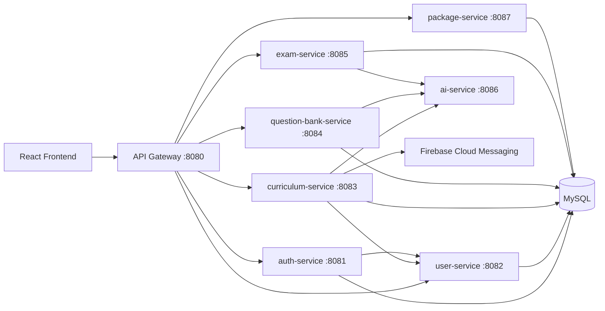
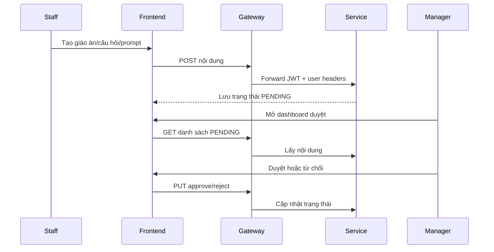

# Software Architecture Document - PlanbookAI

## 1. Kiến trúc tổng quan

PlanbookAI dùng kiến trúc N-tier kết hợp microservice:

## 2. Thành phần

| Thành phần | Trách nhiệm |
| --- | --- |
| Frontend | UI theo role, gọi API, export PDF/Word/CSV, nhận Firebase notification |
| API Gateway | Định tuyến service, kiểm tra JWT, forward user headers |
| Auth Service | Đăng nhập, đăng ký, refresh token, tạo account nội bộ |
| User Service | Hồ sơ người dùng, FCM token, endpoint nội bộ cho service khác |
| Curriculum Service | Subject/chapter/topic/template, giáo án mẫu, giáo án teacher |
| Question Bank Service | Câu hỏi, gợi ý AI, duyệt câu hỏi |
| Exam Service | Tạo đề, bài nộp, kết quả, gọi OCR grading |
| Package Service | Gói dịch vụ, subscription, doanh thu demo |
| AI Service | Prompt, Gemini generation, OCR |
| MySQL | Lưu dữ liệu nghiệp vụ |

## 3. Bảo mật

- Frontend lưu access token và gửi qua `Authorization: Bearer`.
- Gateway xác thực JWT và thêm `X-User-Id`, `X-Role`.
- Service nội bộ dùng Spring Security/role annotation.
- Endpoint nội bộ như FCM token chỉ dùng giữa service trong Docker network.

## 4. Luồng phê duyệt nội dung

## 5. Triển khai

- Local demo: Docker Compose.
- Production đề xuất: VPS/AWS EC2 chạy Docker Compose hoặc ECS/RDS nếu cần mở rộng.
- Render free không phù hợp cho toàn bộ stack vì nhiều service, MySQL persistent và AI/OCR cần runtime ổn định.
